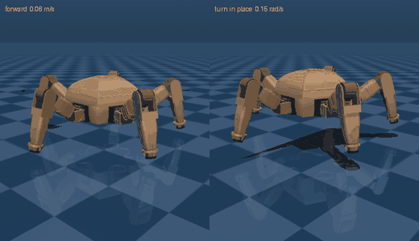

# Rocky

A five-legged walking robot, from CAD to a trained locomotion policy.

Rocky is a pentapod: a 250 mm pentagonal body carrying five identical 342 mm
limbs at 72° spacing, one of which doubles as a manipulator. This repo holds the
simulation model exported from the Fusion 360 master, an analytic wave gait, a
PPO locomotion task for [mjlab](https://github.com/mujocolab/mjlab), and a
manipulation stack that walks up to two cubes and stacks one on the other.



*The trained PPO policy: walking forward at 0.06 m/s (left), turning in place at
0.15 rad/s (right). Full clips: [forward](docs/rocky_walk_forward.mp4),
[turning](docs/rocky_turn_in_place.mp4).*

*Walking up to two cubes and stacking the red one on the blue:
[docs/rocky_stack.mp4](docs/rocky_stack.mp4). The locomotion controller parks the
robot, then hands over to the arm.*


*The analytic wave gait it was taught from, open loop. One foot swings at a
time, in the order 0 → 2 → 4 → 1 → 3.*

## Quick start

```bash
uv sync --extra gait                       # mujoco only, no CUDA needed
uv run python scripts/play_gait.py --vx 0.052 --seconds 12
uv run python -m mujoco.viewer --mjcf=model/rocky_standalone.xml
uv run python scripts/stack_demo.py --episodes 5      # walk up and stack, no GPU
```

Training needs Linux + an NVIDIA GPU (mjlab runs on MuJoCo-Warp):

```bash
uv sync                                    # pulls mjlab, torch, warp
uv run list-envs | grep Rocky
uv run play  Mjlab-Velocity-Flat-Rocky --agent zero      # sanity: it should stand
uv run train Mjlab-Velocity-Flat-Rocky --env.scene.num-envs 4096 --agent.max-iterations 3000
uv run play  Mjlab-Velocity-Flat-Rocky --wandb-run-path <org/project/run-id>
```

## Layout

```
model/          MJCF + URDF exported from Fusion, per-link meshes, collision hulls
  rocky.xml            the model mjlab loads (no actuators; CAD "home" keyframe)
  rocky_standalone.xml + floor, light and position servos, for plain MuJoCo
  rocky_manip.xml      + working jaws, grasp site, head and wrist cameras
  rocky_cubes.xml      + floor, two cubes and the walking servos: the stacking scene
  rocky.urdf           for Isaac Lab / pinocchio / ROS
  build_model.py       regenerates all of the above from the Fusion export
  add_manipulation.py  derives rocky_manip.xml from rocky.xml
src/rocky/
  model_params.py      lengths, limits, servo constants (asserted against the MJCF)
  kinematics.py        per-leg analytic FK/IK
  gait.py              the wave gait
  arm.py               leg 0 as a 4-DOF arm: FK, IK, approach-angle search
  approach.py          walking to a stand-off pose in front of the cubes
  stack.py             the scripted brace-and-stack sequence
  tasks/               mjlab task: entity, env cfgs, PPO cfg
  tasks/mdp/           gait-phase observation and reward terms
scripts/        play_gait.py (open loop), stack_demo.py, train.sh, play.sh
docs/           model.md (the robot), gait.md (the gait), manipulation.md (the arm)
tests/          kinematics, gait invariants, model/MJCF agreement, reward maths,
                arm kinematics against the MJCF, the stacking sequence, approach
```

## The robot

4.170 kg all-up, including 430 g of declared payload. 16 actuated joints: five
legs × (sweep, lift, elbow), plus a wrist on the manipulator limb. For
locomotion its gripper is welded shut and its rubber pad serves as the fifth
foot; `model/rocky_manip.xml` unwelds the jaws, adding two more. Every joint is a
Feetech STS3215 — 2.9 N·m, 1:345, and compliant enough that it shapes how the
robot walks (see below). [docs/model.md](docs/model.md) has the joint table,
mass breakdown and modelling assumptions.

## The gait

A wave gait: one foot swings at a time while the other four stay planted, so the
support polygon always contains the body axis with ~80 mm of margin. Swing order
is the star sequence 0 → 2 → 4 → 1 → 3, which puts consecutive swing legs 144°
apart rather than 72°, keeping the support shift symmetric.

```python
from rocky.gait import WaveGait, GaitParams
gait = WaveGait(GaitParams(period=2.4, stance_height=0.065))
q = gait.action_vector(t=1.3, vx=0.05)        # 16 joint targets
```

Defaults: 2.4 s period, 0.8 duty, 30 mm step height, 65 mm stance height, 582 mm
footprint. Nominal cruise is 52 mm/s from a 100 mm stride.

**Open loop it reaches about 78% of the commanded speed**, and that shortfall is
the servos, not the gait. Raising friction to μ=5 changes nothing; raising the
servo gain to kp=60 recovers 92%. The stance legs push the body forward, the
reaction deflects the position servos, and roughly a fifth of the commanded
stroke disappears into that deflection. It is the clearest argument in the repo
for closing the loop — which is what the policy does.
[docs/gait.md](docs/gait.md) works through the measurements.

## The RL task

`Mjlab-Velocity-Flat-Rocky` is mjlab's velocity-tracking task with three
additions that carry the gait over:

- **A gait clock** in the observation — (sin, cos) of the cycle phase, so the
  policy knows where in the rhythm it is.
- **A contact-schedule reward** — each foot is rewarded for being on the ground
  exactly when the wave gait says it should be.
- **An imitation reward** — the policy is rewarded for matching the scripted
  gait's whole posture at its current phase and commanded velocity, generated by
  `gait_torch.py` and asserted equal to the numpy gait in tests.

That third term exists because the first two are not enough on their own. The
contact schedule constrains *when* a foot is down, never *where* it lands, so a
policy collects it in full by stepping on the spot — which is exactly what
training produced: a 0.88 schedule match while reaching 11–30% of commanded
speed and never turning at all. Adding the imitation term, which does constrain
placement, fixed it in one run.

Commands span ±0.08 m/s forward, ±0.04 m/s lateral and ±0.3 rad/s yaw — the
envelope the gait analysis says the servos can deliver. Actions are
joint-position offsets from the gait's neutral stance.

Also registered: `Mjlab-Velocity-Rough-Rocky` (rough terrain with a height
scan) and `Mjlab-Velocity-Rough-Blind-Rocky` (rough terrain, proprioception
only — same observation layout as the flat task, so a flat-trained checkpoint
runs on it unchanged).

### Results

6000 iterations, 1024 envs, ~3 h on an RTX 4060. Measured by
`scripts/eval_policy.py`, which rolls a controller out at fixed commands for 16 s
and reports **net displacement** — not reward:

| command | trained policy | scripted gait |
|---|---|---|
| 0.02 m/s forward | 0.021 (107%) | 0.017 (87%) |
| 0.04 m/s forward | 0.047 (118%) | 0.035 (87%) |
| 0.06 m/s forward | 0.072 (119%) | 0.051 (85%) |
| 0.08 m/s forward | 0.082 (103%) | 0.065 (82%) |
| 0.04 m/s reverse | 0.055 (137%) | 0.033 (82%) |
| 0.03 m/s lateral | 0.039 (131%) | 0.026 (87%) |
| 0.15 rad/s yaw | 0.121 (81%) | 0.123 (82%) |
| 0.30 rad/s yaw | 0.149 (50%) | 0.180 (60%) |

**The policy beats the controller it was taught from** on every translation
command, and matches it turning. Max body tilt 2.7°, height 63 ± 5 mm, foot
clearance 27–33 mm against a 30 mm target, no falls anywhere in the sweep. It
overshoots — biased fast rather than accurate — and at 0.30 rad/s both
controllers fall short, which is near the machine's real limit rather than a
policy failure.

At low speed it reproduces the reference almost exactly (swing order
`0,2,4,1,3`, 2.0 s cycle against the gait's 2.4 s). Above ~0.05 m/s it abandons
the reference and takes faster, shorter steps to reach speeds the 2.4 s wave gait
cannot — which is why it wins, and why `gait_schedule_match` settles at 0.84
rather than climbing.

### Reading the metrics

Reward curves were wrong about whether this robot was walking in three separate
runs, because mjlab's velocity task is sized for quadrupeds at 1–3 m/s and Rocky
tops out at 0.08 m/s. Everything in velocity units had to be rescaled: the
command curriculum (which overwrote `lin_vel_x` with ±1.0 at step 0), the
`rel_forward_envs` branch (hardcoded `clamp(min=0.3)`), the reward gates, and the
tracking `std` — at the stock 0.25, a robot standing perfectly still while
commanded to walk scored 0.975 of maximum.

Trust `scripts/eval_policy.py` over the reward table.

## Manipulation

Leg 0 is both a leg and an arm. `scripts/stack_demo.py` runs the whole thing in
plain MuJoCo — no GPU, no mjlab:

```bash
uv run python scripts/stack_demo.py --video docs/rocky_stack.mp4
uv run python scripts/stack_demo.py --episodes 20               # success rate
uv run python scripts/stack_demo.py --episodes 50 --dataset data/stack.npz
```

Three phases with a handoff between them. A locomotion controller walks the robot
to a stand-off pose in front of the cubes; both controllers hold the stance for a
beat; then `rocky.stack` widens the four stance legs into a brace, lifts leg 0 off
the ground and runs the pick-and-place, with the other four holding station
throughout. The walk is driven by the analytic gait today, and the trained policy
plugs into the same slot — `rocky.approach` emits the same `(vx, vy, wz)` twist.

**20 of 20 episodes stacked**, over randomised cube layouts (115–150 mm apart,
340–380 mm out, within ±12°) and randomised spawns (0.6–1.2 m back, within ±30°).
Final stack offset 7–9 mm against a 20 mm cube half-width; max body tilt 3.3°.

`--dataset` writes the head and wrist camera views, the joint state, the action
and the phase label at 20 Hz for the manipulation segment — the demonstrations a
VLA needs to take over that half.

[docs/manipulation.md](docs/manipulation.md) covers the arm's kinematics, the
approach-angle search the ±75° wrist forces, the four pieces of geometry that
break the obvious version of this script, and the measured working envelope.

## Tests

```bash
uv run --extra dev pytest          # or: PYTHONPATH=src pytest
```

Covers IK/FK round-trips and joint limits, the gait invariants (exactly one leg
airborne, correct swing order, support margin), agreement between
`model_params.py` and the compiled MJCF, URDF/MJCF equivalence, and the reward
maths against a stub env.

## Status and next steps

Done: model, gait, task, harness, and a trained policy that walks and turns,
verified by displacement rather than reward.

Next:

- **Rough terrain.** `Mjlab-Velocity-Rough-Rocky` is registered and configured;
  the blind variant lets the current checkpoint be tried on terrain first.
- **A VLA for the manipulation half.** The scripted sequence is a demonstrator,
  not the destination: `scripts/stack_demo.py --dataset` already writes what a
  policy needs to learn it. Registering the cube scene as an mjlab task, so the
  arm can also be trained or fine-tuned with RL, is the piece that is missing.
- **Widening the arm's envelope.** The scripted stack fails inside 320 mm and
  outside ±15° of bearing (docs/manipulation.md has the table). The approach
  controller avoids both, but a learned policy should not have to.
- **ONNX export** currently fails on an rsl-rl/mjlab version mismatch
  (`Logger` has no `logger_type`). The `.pt` checkpoints are fine.
- **`ROTOR_INERTIA`** in `model_params.py` is assumed — Feetech publish no
  figure — and it sets armature, kp and kv together. It is the largest
  sim-to-real unknown in the model; randomising it during training would show
  how much the gait depends on getting it right.
