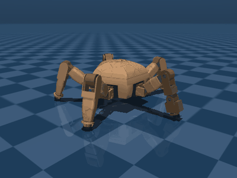

# The wave gait

Rocky walks a **wave gait**: one foot in the air at a time, the other four
planted. For a five-legged machine that is the natural statically stable crawl,
and it is the first rung of the development ladder -- stand, crawl, coordinate,
balance on four while the manipulator works.



## Timing

The cycle is one *period* long and every leg swings exactly once in it. With a
duty factor of 0.8 each foot is planted for 80% of the cycle, which for five legs
means the swing windows tile the cycle end to end with exactly one leg airborne
at any instant.

Swing order is the star sequence **0 → 2 → 4 → 1 → 3**, not the geometric order
0 → 1 → 2 → 3 → 4. Consecutive swing legs then sit 144° apart instead of 72°, so
the support quadrilateral flips symmetrically about the body rather than walking
its way around it. Over a cycle at cruise the body axis stays
78–102 mm inside the support polygon.

| parameter | default | what it does |
|---|---|---|
| `period` | 2.4 s | one full cycle; every leg swings once |
| `duty` | 0.8 | fraction of the cycle a foot is planted |
| `swing_order` | (0, 2, 4, 1, 3) | which leg takes which swing slot |
| `step_height` | 30 mm | peak foot lift |
| `stance_height` | 65 mm | body origin above the contact plane |
| `footprint_scale` | 1.05 | scales the neutral footprint (581 mm across) |

The stance is deliberately taller and wider than the CAD pose (65 vs 45 mm,
582 vs 555 mm). The CAD stance sits at elbow 122° with a 130° stop — only 8° of
fold left, and a stride needs more than that. Widening the footprint straightens
the legs to elbow 112°, which
puts the joint mid-range with room both ways, and the footprint stays inside the
550–650 mm design envelope.

## Foot trajectories

Targets are planned as **ground contact points in the body frame**, then offset
by the foot sphere radius and solved for joint angles. Planting a foot means
moving it backwards through the body frame at exactly the commanded body
velocity; that is the whole kinematic contract of a stance phase, and
`tests/test_gait.py` asserts it.

Swing interpolates between the end and start of the stroke with a smoothstep in
the horizontal plane and a raised sine vertically, so both position and velocity
are continuous at lift-off and touch-down.

Turning rotates the neutral footprint about the body axis by `-wz` through the
stance, which composes with translation.

## What limits it

**Servo speed sets the top speed, not geometry.** With one leg airborne at a
time, the swing foot has to cover a whole stride in 20% of the cycle -- it moves
at five times body speed. At the default 2.4 s period:

| stride (mm) | body speed (m/s) | within joint limits | peak joint speed (rad/s) | % of no-load |
|---|---|---|---|---|
| 60 | 0.031 | yes | 1.80 | 38% |
| 80 | 0.042 | yes | 2.09 | 45% |
| 100 | 0.052 | yes | 2.59 | 55% |
| 120 | 0.062 | no | 3.11 | 66% |
| 140 | 0.073 | no | 3.64 | 77% |

**Translation and yaw compete for the same workspace.** A foot's stroke is
shared between carrying the body forward and swinging it around the turn:

| forward speed (m/s) | max yaw rate (rad/s) |
|---|---|
| 0.000 | 0.40 |
| 0.020 | 0.34 |
| 0.040 | 0.28 |
| 0.052 | 0.08 |

`WaveGait.clamp_command` scales a request uniformly until it fits, which keeps
the foot paths geometrically consistent instead of clipping joints and making the
legs fight each other.

## Open loop it loses a fifth of its speed, and that is the servos

Commanded 52 mm/s, the robot makes about 41 mm/s -- 78%.
Chasing that gap is the most useful thing in this document, because the answer
decides what the RL policy is actually for.

| change | achieved / commanded | body sag |
|---|---|---|
| baseline (μ=1, kp=23.5) | 78% | 8.6 mm |
| friction μ=2 | 78% | 8.6 mm |
| friction μ=5 | 78% | 8.6 mm |
| kp=60 | 92% | 3.9 mm |
| kp=150 | 91% | 2.1 mm |

Friction changes nothing; stiffness changes everything. The missing motion is
not the feet sliding on the floor, it is the **position servos deflecting under
the load of pushing the body along**. A stiff-position-controlled leg is a spring
in series with the drive, and roughly a fifth of each commanded stroke
disappears into that spring. The same compliance shows up as the 8.6 mm sag and
the ~5° mean tracking error.

Three consequences worth carrying forward:

1. An open-loop gait on these servos will always undershoot. The fix is
   feedback, which is what the policy provides.
2. `ROTOR_INERTIA` (assumed, since Feetech publish no figure) sets armature, kp
   and kv together, so it is the single most load-bearing guess in the model.
   Worth randomising during training.
3. Four planted feet under stiff position control is an over-constrained closed
   chain. Ripple or tripod-style gaits, with fewer feet down, fight themselves
   less -- something to revisit if the wave gait proves too slow.

## Using it

```python
from rocky.gait import WaveGait, GaitParams

gait = WaveGait(GaitParams(period=2.0, step_height=0.035))
vx, vy, wz = gait.clamp_command(0.06, 0.0, 0.2)     # scale into the envelope
q = gait.action_vector(t=1.3, vx=vx, vy=vy, wz=wz)  # 16 joint targets
print(gait.check_feasible(vx, vy, wz))
```

```bash
python scripts/play_gait.py --vx 0.052 --seconds 12          # measure it
python scripts/play_gait.py --vx 0.03 --wz 0.25 --gif out.gif
```

`play_gait.py` reports achieved vs commanded velocity, servo tracking error,
foot slip and support margin -- the numbers to watch when retuning.
